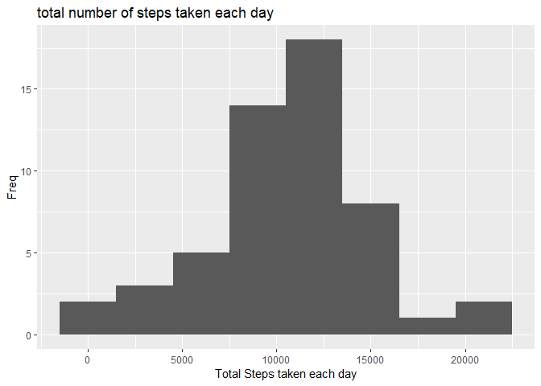
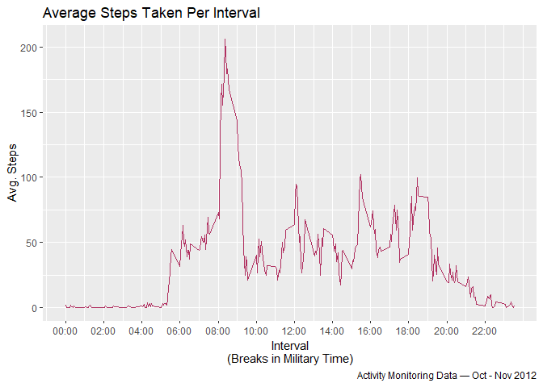
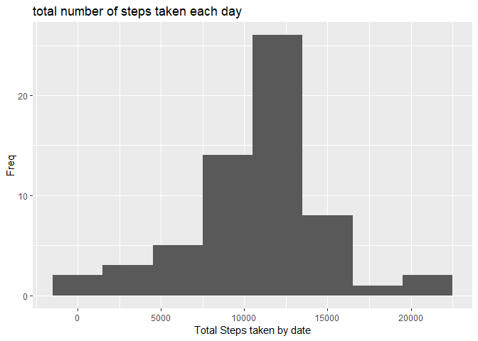
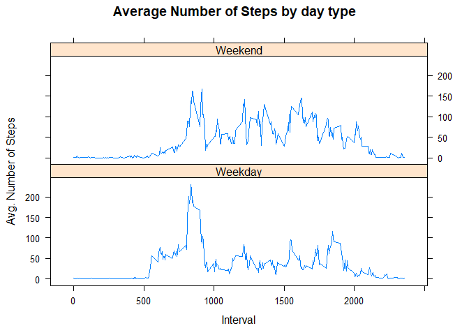

## **1. Loading and preprocessing the data**


```r
library(tidyverse) 
library(lubridate)
library(knitr)
library(scales)
library(xtable)
library(kableExtra)
library(lattice)
opts_chunk$set(echo = TRUE)
```

* Download and unzip Data from web 


```r
data_url <- "https://d396qusza40orc.cloudfront.net/repdata%2Fdata%2Factivity.zip"
down.file <- "./Data/AMD.zip"
data <- "./data/activity.csv"

if (!file.exists(down.file)) { # If data has been already downloadead will use existing file
    
    download.file(data_url, destfile = down.file)
    unzip(zipfile = down.file,exdir = "Data/")
} else { 
    
    cdate <- file.info(data)$ctime
    message(paste0("The file '", basename(data) ,"' has already been downloaded on ",cdate,", loading from disk..."))
    rm(cdate)
}

### Load Raw Data to Memory ###
rawdata <- read_csv(data)
data <- na.exclude(rawdata) # remove na.values
```

## **2. What is mean total number of steps taken per day?**

* Produce Histogram with the freq. dist. of total Steps by Day


```r
stepsbydate <- group_by(data,date) %>% summarise(total.steps=sum(steps))

with(stepsbydate, total.steps %>% qplot(binwidth=3000, 
                                        xlab = "Total Steps taken each day", 
                                        ylab = "Freq",
                                        main = "total number of steps taken each day"
                                        )
     )
```

<!-- -->
<table class="table table-striped" style="width: auto !important; margin-left: auto; margin-right: auto;">
 <thead>
  <tr>
   <th style="text-align:left;">   </th>
   <th style="text-align:left;"> mean </th>
   <th style="text-align:left;"> median </th>
  </tr>
 </thead>
<tbody>
  <tr>
   <td style="text-align:left;"> Steps per day </td>
   <td style="text-align:left;"> 10,766.19 </td>
   <td style="text-align:left;"> 10,765 </td>
  </tr>
</tbody>
</table>


## **3. What is the average daily activity pattern?**


```r
avgstepsinterval <- group_by(data,interval) %>% summarise(avg.steps=mean(steps))

ggplot(avgstepsinterval,aes(x=interval,y=avg.steps)) +
    geom_line(colour="maroon") +
    labs(title = "Average Steps Taken Per Interval",
         caption= "Activity Monitoring Data — Oct - Nov 2012",
         x="Interval\n(Breaks in Military Time)",
         y="Avg. Steps") +
    scale_x_continuous(breaks=seq(0,2355,200),
                       labels = seq(0,2355,200) %>% sprintf(fmt = "%04d") %>% strptime(format = "%H%M") %>% format(format="%H:%M"))
```

<!-- -->


```r
maxsteps <- avgstepsinterval[which.max(avgstepsinterval$avg.steps),]

kable(maxsteps) %>% 
    kable_styling(bootstrap_options = "striped", 
                  full_width = F,
                  position = "left")
```

<table class="table table-striped" style="width: auto !important; ">
 <thead>
  <tr>
   <th style="text-align:right;"> interval </th>
   <th style="text-align:right;"> avg.steps </th>
  </tr>
 </thead>
<tbody>
  <tr>
   <td style="text-align:right;"> 835 </td>
   <td style="text-align:right;"> 206.1698 </td>
  </tr>
</tbody>
</table>

    The interval with the highest average number of steps across all days is 0835.

## **4. Imputing missing values**
    

**Total number of rows containing missing values:** 2,304

* fill in NA values with interval's mean.

```r
data2 <- rawdata %>% 
         group_by(date) %>%
         mutate(steps=if_else(condition = is.na(steps),
                              true = avgstepsinterval$avg.steps[interval %in% avgstepsinterval$interval],
                              false = as.double(steps)))
```


```r
stepsbydate2 <- data2 %>% group_by(date) %>% 
                summarise(total.steps=sum(steps))  
stepsbydate2 %>% .$total.steps %>% 
                 qplot(binwidth=3000,
                      xlab = "Total Steps taken by date", 
                      ylab = "Freq",
                      main = "total number of steps taken each day"
                      )
```

<!-- -->

<table class="table table-striped" style="width: auto !important; margin-left: auto; margin-right: auto;">
 <thead>
  <tr>
   <th style="text-align:left;">   </th>
   <th style="text-align:left;"> mean </th>
   <th style="text-align:left;"> median </th>
  </tr>
 </thead>
<tbody>
  <tr>
   <td style="text-align:left;"> Steps per day </td>
   <td style="text-align:left;"> 10,766.19 </td>
   <td style="text-align:left;"> 10,766.19 </td>
  </tr>
</tbody>
</table>
**Estimate Comparison**

Estimate|Mean Steps|Median Steps
---|---|---
Removing NA Values|10,766.19|10,765
Filling in NA Values(w/mean)|10,766.19|10,766.19

## **5. Are there differences in activity patterns between weekdays and weekends?**

Create a new factor variable in the dataset with two levels - “weekday” and “weekend” indicating whether a given date is a weekday or weekend day.

```r
data2 <- data2 %>% mutate(wk= ordered(weekdays(date),
                            levels= c("Monday","Tuesday","Wednesday","Thursday","Friday","Saturday","Sunday"),
                            labels=c(rep("Weekday",5),rep("Weekend",2))
                        
                             
                             )
                ) 
```

```r
avgstepsinterval2 <- group_by(data2,interval,wk) %>% summarise(avg.steps=mean(steps))

xyplot(avg.steps~interval|wk,
       data = avgstepsinterval2, 
       type="l",
       layout=c(1,2),
       xlab = "Interval",
       ylab = "Avg. Number of Steps",
       main= "Average Number of Steps by day type")
```

<!-- -->


